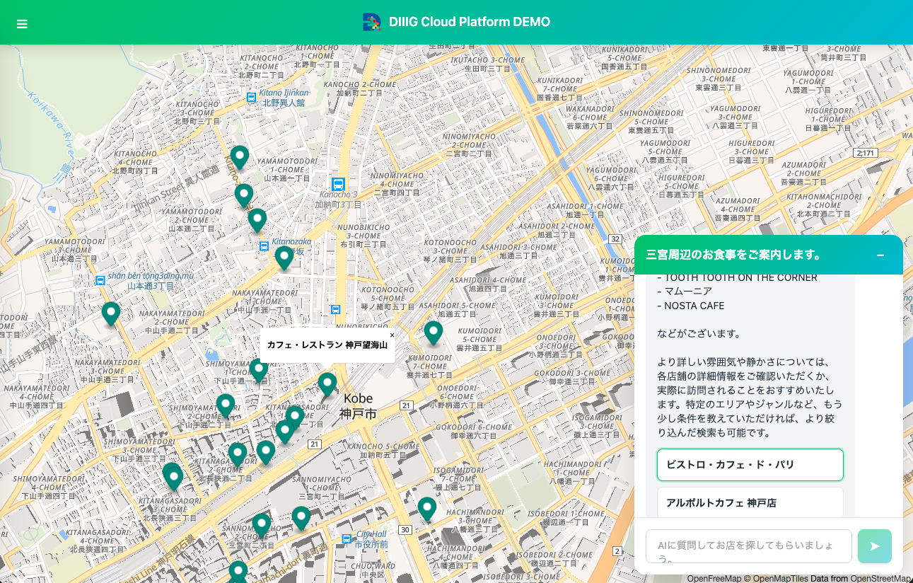

# AI・MCP連携マップデモ

[日本語](#) | [English](./README.en.md)

AIチャットとマップを融合したWebアプリケーション。Anthropic Claude APIとDCP (DIIIG Cloud Platform) MCPを活用して、ユーザーの質問に対してインタラクティブにPOI情報を提供します。



## デモサイト
- [AI・MCP連携マップデモサイト](https://mcpmapdemo.diiig.info/)

## 特徴

- **AIチャット**: Claude (Anthropic) APIを使用した対話型インターフェース
- **MCP Connector統合**: Anthropic API経由でDCP MCPと連携して正確なPOI情報を取得
- **マルチマップ対応**: Mapbox、MapLibre、Google Mapsに対応
- **SSEストリーミング**: リアルタイムでAIの応答を表示
- **レスポンシブデザイン**: モバイル・デスクトップ両対応
- **チャット履歴**: LocalStorageベースの会話履歴保存

## 必要要件

### Docker を使用する場合（推奨）

- Docker
- Docker Compose
- 以下のいずれかのAPIキー:
  - Anthropic API キー
  - DCP API キー
  - Mapbox / Google Maps APIキー (使用するマップシステムに応じて)

### 手動セットアップの場合

- PHP 8.x以上
- Webサーバー (Apache、Nginx等)
- 上記と同じAPIキー

## セットアップ

### 方法1: Docker を使用（推奨）

最も簡単な方法です。

#### 1. リポジトリをクローン

```bash
git clone [repository-url]
cd mcp_map_sample
```

#### 2. 設定ファイルの作成

`lib/config.example.php` をコピーして `lib/config.php` を作成します:

```bash
cp lib/config.example.php lib/config.php
```

#### 3. APIキーの設定

`lib/config.php` を編集して、各種APIキーを設定します:

```php
// Anthropic API設定
define('ANTHROPIC_API_KEY', 'your-anthropic-api-key-here');

// DCP API設定
define('DCP_MCP_URL', 'your-dcp-mcp-url-here');
define('DCP_API_KEY', 'your-dcp-api-key-here');

// マップシステム設定
define('MAP_SYSTEM', 'mapbox'); // 'mapbox', 'maplibre', 'googlemaps'

// Mapbox設定 (Mapboxを使用する場合)
define('MAPBOX_ACCESS_TOKEN', 'your-mapbox-access-token-here');

// Google Maps設定 (Google Mapsを使用する場合)
define('GOOGLE_MAPS_API_KEY', 'your-google-maps-api-key-here');
```

**⚠️ 重要: Google Maps使用時のセキュリティ設定**

Google Mapsを使用する場合、APIキーが公開されるため**必ず以下の制限を設定**してください：

1. [Google Cloud Console](https://console.cloud.google.com/) でAPIキーを開く
2. 「アプリケーション制限」で **「HTTPリファラー」** を選択
3. 許可するウェブサイトを追加:
   - 本番環境: `https://yourdomain.com/*`
   - 開発環境: `http://localhost:*`
4. 「API制限」で **「Maps JavaScript API」のみ** を有効化

これらの設定を行わないと、第三者にAPIキーを悪用され、高額請求される可能性があります。

**推奨**: セキュリティを重視する場合は、APIキー不要の **MapLibre** の使用をお勧めします。

#### 4. Dockerコンテナを起動

```bash
docker-compose up -d
```

#### 5. アプリケーションにアクセス

ブラウザで `http://localhost:8080` にアクセスします。

#### Docker コマンド

```bash
# コンテナを起動
docker-compose up -d

# ログを確認
docker-compose logs -f

# コンテナを停止
docker-compose down

# イメージを再ビルド
docker-compose build
```

### 方法2: 手動セットアップ

#### 1. リポジトリをクローン

```bash
git clone [repository-url]
cd mcp_map_sample
```

#### 2. 設定ファイルの作成

`lib/config.example.php` をコピーして `lib/config.php` を作成します:

```bash
cp lib/config.example.php lib/config.php
```

### 3. APIキーの設定

`lib/config.php` を編集して、各種APIキーを設定します。

**⚠️ Google Maps使用時は、上記「方法1」のセキュリティ設定を必ず実施してください。**

### 4. Webサーバーの設定

`public_html` ディレクトリをドキュメントルートとして設定します。

#### Apache の場合

```apache
<VirtualHost *:80>
    DocumentRoot "/path/to/aimap/public_html"
    <Directory "/path/to/aimap/public_html">
        AllowOverride All
        Require all granted
    </Directory>
</VirtualHost>
```

#### Nginx の場合

```nginx
server {
    listen 80;
    root /path/to/aimap/public_html;
    index index.html;

    location / {
        try_files $uri $uri/ =404;
    }

    location ~ \.php$ {
        fastcgi_pass unix:/var/run/php/php8.2-fpm.sock;
        fastcgi_index index.php;
        fastcgi_param SCRIPT_FILENAME $document_root$fastcgi_script_name;
        include fastcgi_params;
    }
}
```

### 5. アプリケーションの起動

Webサーバーを起動して、ブラウザで `http://localhost` にアクセスします。

## ディレクトリ構造

```
mcp_map_sample/
├── docker/
│   ├── nginx.conf          # Nginx設定
│   └── start.sh            # コンテナ起動スクリプト
├── lib/
│   ├── config.example.php  # 設定ファイルのサンプル
│   └── config.php          # 実際の設定ファイル (要作成)
├── public_html/
│   ├── index.html          # メインHTML
│   ├── api/
│   │   ├── chat.php        # チャットAPI (Anthropic + MCP)
│   │   ├── config.php      # 設定API
│   │   └── poi-detail.php  # POI詳細API
│   ├── js/
│   │   ├── app.js          # Vue.jsアプリケーション
│   │   └── map.js          # マップシステム統合
│   ├── css/
│   └── img/
├── Dockerfile              # Docker設定
├── docker-compose.yml      # Docker Compose設定
└── README.md               # このファイル
```

## 使い方

### 基本的な使い方

1. **チャットを開始**: 画面下部のチャット入力欄に質問を入力
2. **POI検索**: 「〇〇エリアの観光スポットを教えて」などと質問
3. **マップ表示**: AIが提案したPOIがマップ上にマーカーとして表示される
4. **詳細確認**: マーカーをクリックしてPOI詳細を表示

### サイドメニュー

- **新規チャット作成**: 左上のメニューから新しいチャットスレッドを作成
- **過去のチャット**: サイドバーから過去のチャット履歴を確認
- **設定**: テーマ変更、言語設定、ヘルプなど

## API仕様

### チャットAPI (POST /api/chat.php)

Anthropic APIとMCP Connectorを使用してPOI情報を取得します。

**リクエスト:**

```json
{
  "message": "ユーザーのメッセージ",
  "history": [
    {
      "role": "user",
      "content": "過去のメッセージ"
    }
  ]
}
```

**レスポンス (SSE):**

リアルタイムでストリーミング配信されます。

```
event: message
data: {"text": "回答の一部"}

event: message
data: {"text": "追加のテキスト"}

event: done
data: {"message": "Stream completed"}
```

**POI情報の形式:**

AIの応答には、POI情報が以下の形式で埋め込まれます:

```
通常のテキスト回答

---POI_DATA---
{
    "pois": [
        {
            "poi_id": "...",
            "name": "...",
            "latitude": ...,
            "longitude": ...,
            "category": "..."
        }
    ]
}
```

### 設定API (GET /api/config.php)

フロントエンドにマップ設定を提供します（APIキーは除く）。

**レスポンス:**

```json
{
  "type": "maplibre",
  "config": {
    "center": {
      "lat": 34.69364108831769,
      "lng": 135.19343441838353
    },
    "zoom": 12,
    "style": "https://tiles.openfreemap.org/styles/liberty"
  }
}
```

### POI詳細API (GET /api/poi-detail.php)

DCP APIから特定のPOI詳細情報を取得します。

**パラメータ:**
- `poi_id`: POIのID

**例:**
```
GET /api/poi-detail.php?poi_id=12345
```

## 対応マップシステム

### Mapbox

```php
define('MAP_SYSTEM', 'mapbox');
define('MAPBOX_ACCESS_TOKEN', 'your-token');
define('MAPBOX_STYLE', 'mapbox://styles/mapbox/streets-v12');
```

### MapLibre

```php
define('MAP_SYSTEM', 'maplibre');
define('MAPLIBRE_STYLE', 'https://demotiles.maplibre.org/style.json');
```

### Google Maps

```php
define('MAP_SYSTEM', 'googlemaps');
define('GOOGLE_MAPS_API_KEY', 'your-api-key');
```

**⚠️ セキュリティ注意:**
Google Maps APIキーはフロントエンドに公開されます。必ず以下の対策を行ってください：

1. **Google Cloud Console**で**APIキー制限**を設定
2. **アプリケーション制限**で「HTTPリファラー」を選択
3. 許可するリファラーを追加:
   - 本番: `https://yourdomain.com/*`
   - 開発: `http://localhost:*`
4. **API制限**で「Maps JavaScript API」のみを有効化

## トラブルシューティング

### チャットが動作しない

- `lib/config.php` のAPIキーが正しく設定されているか確認
- ブラウザのコンソールでエラーメッセージを確認
- PHPのエラーログを確認

### マップが表示されない

- 使用するマップシステムのAPIキーが正しく設定されているか確認
- `MAP_SYSTEM` の値が正しいか確認 (`mapbox`, `maplibre`, `googlemaps`)
- ブラウザの開発者ツールでネットワークエラーを確認

### POIがマップに表示されない

- DCP APIの接続を確認
- ブラウザのコンソールでAPIレスポンスを確認
- POIデータの形式が正しいか確認

## 開発

### ローカル開発環境

PHPビルトインサーバーで開発する場合:

```bash
cd public_html
php -S localhost:8000
```

### デバッグモード

`lib/config.php` でデバッグモードを有効化:

```php
define('DEBUG_MODE', true);
```

## コントリビューション

プルリクエストを歓迎します！大きな変更の場合は、まずIssueを開いて変更内容を議論してください。

### 開発の流れ

1. このリポジトリをフォーク
2. フィーチャーブランチを作成 (`git checkout -b feature/amazing-feature`)
3. 変更をコミット (`git commit -m 'Add amazing feature'`)
4. ブランチにプッシュ (`git push origin feature/amazing-feature`)
5. プルリクエストを開く

## ライセンス

このプロジェクトはMITライセンスの下で公開されています。詳細は [LICENSE](LICENSE) ファイルを参照してください。

## 作成者

- 開発: DIIIG Inc.

## 謝辞

- [Anthropic](https://www.anthropic.com/) - Claude API
- [OpenFreeMap](https://openfreemap.org/) - 無料の地図タイル

## 参考リンク

- [Anthropic API Documentation](https://docs.anthropic.com/)
- [DIIIG Cloud Platform](https://dcp.diiig.info/)
- [DCP API Documentation](https://dcp.diiig.info/docs/api)
- [Anthropic MCP Connector](https://docs.claude.com/en/docs/agents-and-tools/mcp-connector)
- [Mapbox GL JS](https://docs.mapbox.com/mapbox-gl-js/)
- [MapLibre GL JS](https://maplibre.org/maplibre-gl-js/docs/)
- [Google Maps JavaScript API](https://developers.google.com/maps/documentation/javascript)
